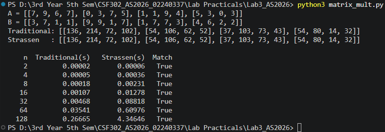
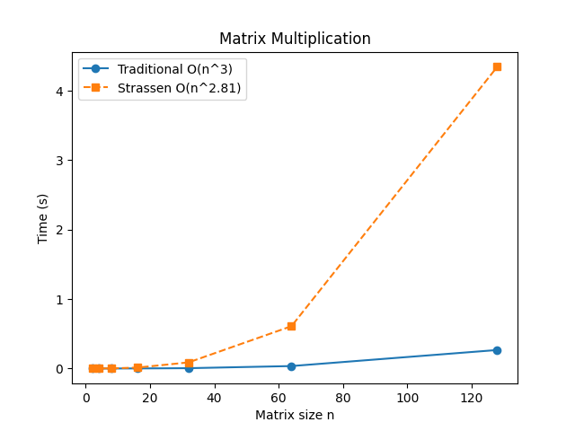
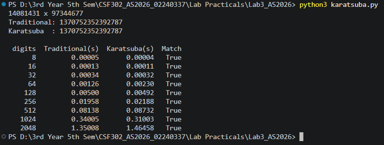
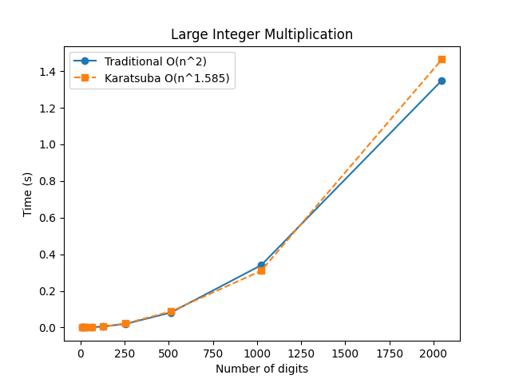
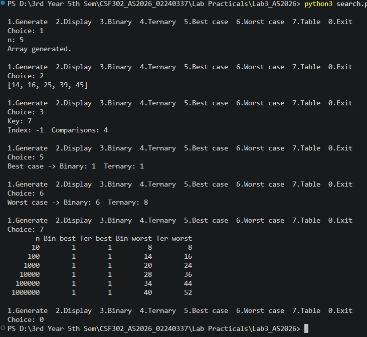
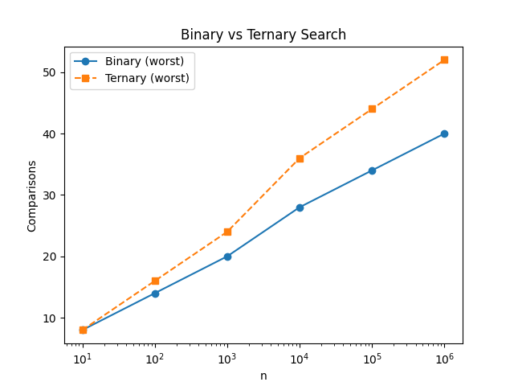

# CSF302 – Lab 3

**Student Code:** 02240337

## Files

| File | Question | Description |
|---|---|---|
| `matrix_mult.py` | Q1 | Traditional (O(n³)) vs Strassen's (O(n^2.81)) matrix multiplication |
| `karatsuba.py` | Q2 | Grade-school (O(n²)) vs Karatsuba (O(n^1.585)) large integer multiplication |
| `search.py` | Q3 | Menu-driven Binary vs Ternary Search with comparison counts |
| `*_graph.png` | – | Graphs generated by each program |

## Outputs

### Q1: Matrix Multiplication





### Q2: Karatsuba Multiplication





### Q3: Binary vs Ternary Search





## How to Run

```bash
pip install matplotlib
python3 matrix_mult.py
python3 karatsuba.py
python3 search.py
```

Q1 and Q2 run automatically. They print a sample result, a timing table, and a match check, then save a graph. Q3 opens a menu. Generate an array with option 1 first, then use options 2–7. Option 7 prints the comparison table and saves the graph.

## Summary of Results

**Q1:** Both methods gave identical matrices for every size from 2×2 to 128×128. Strassen was slower in practice because recursion and the extra matrix additions add a lot of overhead in Python.

**Q2:** Karatsuba matched the traditional method in every test from 8 to 2048 digits. Below 32 digits it switches to the traditional method to avoid recursion overhead. Karatsuba starts to pull ahead at around 1024 digits or more.

**Q3:** Comparison counts (worst case, key absent):

| n | Binary | Ternary |
|---|---|---|
| 1,000 | 20 | 24 |
| 1,000,000 | 40 | 52 |

Both searches need only 1 comparison in the best case.

- Binary search follows T(n) = T(n/2) + O(1), which gives about 2·log₂n comparisons.
- Ternary search follows T(n) = T(n/3) + O(1), which gives about 4·log₃n ≈ 2.52·log₂n comparisons.

Ternary search goes through fewer iterations, but each iteration needs more comparisons. As a result, binary search makes fewer comparisons in total.

Detailed conclusions are written as comments at the end of each source file.

## Screenshots


## Graphs:


